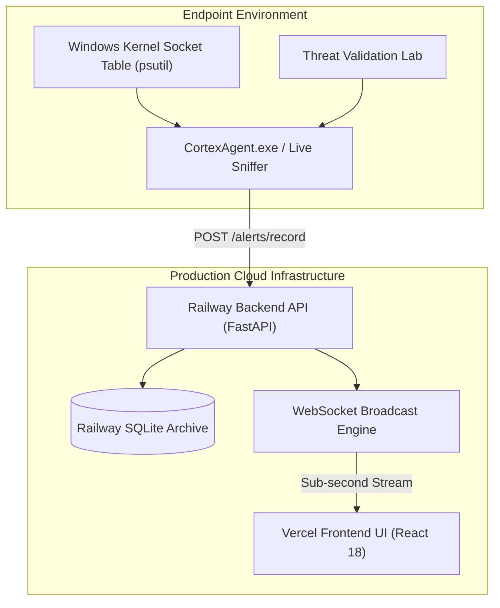

<div align="center">

# CORTEX NIDS
### Commercial-Grade Real-Time Network Intrusion Detection System & Security Operations Platform

<p align="center">
  
  
  
  
  
  
  
</p>

[**Live Website**](https://cortex-nids.vercel.app) • [**Live Cloud API**](https://web-production-31259.up.railway.app/health) • [**GitHub Repository**](https://github.com/saifvector/cortex-nids) • [**Quick Start**](#quick-start--installation) • [**Desktop Agent Guide**](#cortexagentexe---standalone-desktop-app)

---

</div>

## Executive Overview

**Cortex NIDS** is an enterprise-class, machine learning-powered Security Operations Center (SOC) platform designed to sniff, classify, score, and neutralize high-throughput network threats in real time. 

Powered by a **LightGBM Classifier Engine (`99.87%` accuracy, `<15ms` latency)** trained on 2.83M CICIDS2017 flow samples, Cortex NIDS combines:
1. **Live Cloud Platform (Vercel + Railway)**: Real-time WebSockets threat streaming, analytical heatmaps, and downloadable PDF security audit reports.
2. **Standalone Desktop Agent (`CortexAgent.exe`)**: Desktop GUI with real-time socket packet sniffing, live Windows process identification (`[brave.exe]`, `[Code.exe]`, `[svchost.exe]`), and a built-in **Threat Validation Laboratory**.

---

## 💻 CortexAgent.exe — Standalone Desktop App

`CortexAgent.exe` is a single-file, 147MB Windows executable designed for zero-config deployment on endpoint machines.

```text
+-----------------------------------------------------------------------------------------+
|  CORTEX AGENT — Enterprise Network Threat Detection                                     |
|  [Dashboard]  [Monitoring]  [Threat Lab]  [Detection Logs]  [Settings]  [About]           |
|                                                                                         |
|  REAL-TIME DETECTION CONSOLE                                                             |
|  [14:00:15] [FLOW ] Flow [brave.exe] [172.16.0.110 -> :443] | BENIGN | 99.6% | 13.4ms    |
|  [14:00:22] [THREAT] 🚨 ALERT [Critical]: DoS GoldenEye | Risk: 88.4/100 | 11.2ms           |
|  [14:00:25] [FLOW ] Flow [Code - Insiders.exe] [172.16.0.36 -> :80] | BENIGN | 98.7%   |
+-----------------------------------------------------------------------------------------+
```

### Key Desktop Capabilities:
* 📡 **Mode 1: Live Packet Monitor**: Sniffs real network traffic from active network adapters, computes 20-feature 5-tuple flow metrics, and streams predictions in `<15ms`.
* ⚡ **Mode 2: Threat Validation Laboratory**: Generates calibrated attack vectors (**DoS GoldenEye**, **DDoS**, **PortScan**, **Botnet C2**) to benchmark and test detection accuracy on-demand.
* 🔎 **Automatic Windows Process Name Resolution**: Uses real-time kernel socket table lookups (`psutil.net_connections`) to match network flows to responsible active executables (`[brave.exe]`, `[chrome.exe]`, `[msedge.exe]`, `[Code.exe]`, `[svchost.exe]`, `[git.exe]`).
* ☁️ **Cloud Synchronization**: Posts detected security incidents live to the Railway backend API and streams them instantly to the Vercel web console over WebSockets.

---

## Key Features at a Glance

| Feature Module | Description | Technical Implementation |
| :--- | :--- | :--- |
| **Cortex Desktop Agent** | Standalone executable GUI with socket sniffing & process resolution. | CustomTkinter + PyInstaller (`147MB`) |
| **Live Threat Monitor** | Sub-second real-time WebSocket alert stream with animated threat cards. | Scapy Sniffer + `/ws/alerts` WebSockets |
| **ML Prediction Engine** | 15-class intrusion classifier scoring risk levels (`Low` to `Critical`). | LightGBM + Joblib Pipeline |
| **Process Identification**| Matches network flows to local Windows executables (`[brave.exe]`, `[Code.exe]`). | Kernel Socket Matching (`psutil`) |
| **Historical Archive** | Permanent SQLite threat database (`alerts.db`) with full search & modal inspection. | SQLite + SQLAlchemy + Dynamic Filters |
| **Historical Analytics** | Threat trend timelines, attack pie charts, and top attacker IP heatmaps. | Recharts + Analytical Queries |
| **Dynamic Report Engine** | Compiles on-demand **PDF**, **HTML**, **CSV**, and **Markdown** security audit reports. | ReportLab + Dynamic Pandas Exporter |
| **Global System Search** | Instant modal search matching IPs, Attack Types, Alert IDs, Ports, and Modules. | `GET /search` + `⌘K` / `Ctrl+K` Hotkey |

---

## 🌐 Live Cloud Deployment Architecture



---

## Application Access Points

| Service | Access URL | Description |
| :--- | :--- | :--- |
| **Vercel Web App** | [https://cortex-nids.vercel.app](https://cortex-nids.vercel.app) | Live Production Liquid Glass SOC Platform |
| **Live Threat Stream** | [https://cortex-nids.vercel.app/live-threats](https://cortex-nids.vercel.app/live-threats) | Real-time WebSocket Threat Monitor |
| **Railway API Health** | [https://web-production-31259.up.railway.app/health](https://web-production-31259.up.railway.app/health) | Production FastAPI Cloud API Endpoint |
| **Desktop Executable** | [`dist/CortexAgent.exe`](file:///c:/Users/saifu/Desktop/Network%20Intrusion%20Detection/dist/CortexAgent.exe) | Standalone Windows GUI Security Agent (`147MB`) |
| **Local React UI** | [http://localhost:3000](http://localhost:3000) | Local Development React Platform |
| **Local FastAPI Docs** | [http://localhost:8000/docs](http://localhost:8000/docs) | Interactive OpenAPI Swagger Reference |

---

## Live Telemetry & Traffic Testing Guide

You can test live intrusion detection using either the **Standalone Desktop Application**, **Real Packet Sniffing**, or **Synthetic Attack Simulation**.

### Method 1: Standalone Desktop Agent (`CortexAgent.exe`)

1. **Launch Executable**:
   Double-click **`dist/CortexAgent.exe`** (or run `.\.venv\Scripts\python.exe agent/cortex_agent.py`).
2. **Start Monitoring**:
   Click **`📡 Monitoring`** -> **`▶ Start Monitoring`**.
   *Open Brave, Chrome, or VS Code to observe live process-attributed network traffic.*
3. **Run Threat Test**:
   Click **`⚡ Threat Lab`** -> Select **`DoS GoldenEye Flood`** or **`DDoS Attack Vector`** -> Click **`⚡ Start Simulation`**.
   *Watch red threat alerts stream live on both the desktop console and the public Vercel website!*

---

### Method 2: Synthetic Threat Generator CLI (`scripts/simulate_live_attacks.py`)

```powershell
# Stream live threat traffic every 1.0 second continuously to Cloud Backend
.\.venv\Scripts\python.exe scripts/simulate_live_attacks.py --interval 1.0 --duration 0
```

| Profile Name | Target Protocol | Description |
| :--- | :--- | :--- |
| **BENIGN** | HTTP (80/443), DNS (53) | Clean web browsing & name resolution traffic. |
| **DoS GoldenEye** | HTTP (80/443) | High packet-volume HTTP Denial-of-Service attack. |
| **DDoS** | TCP (80/8080/22) | Volumetric Distributed Denial-of-Service attack. |
| **PortScan** | Multi-Port Probes | Rapid single-packet scanning across ports 21–8443. |

---

## Quick Start & Installation

```bash
# Clone the repository
git clone https://github.com/saifvector/cortex-nids.git
cd cortex-nids
```

### Option 1: Automated Local Setup

#### Windows (PowerShell):
```powershell
powershell -ExecutionPolicy Bypass -File setup.ps1
```

#### Linux / macOS (Bash):
```bash
chmod +x setup.sh && ./setup.sh
```

---

### Option 2: Build Desktop Executable (`CortexAgent.exe`)

```powershell
# Package standalone Windows desktop binary using PyInstaller
.\.venv\Scripts\python.exe scripts/build_agent.py
```

---

## Dataset & Machine Learning Performance

The system is trained on **2,830,743 network traffic records** from the benchmark CICIDS2017 dataset, covering 15 attack vectors.

### Model Evaluation Metrics:

| Classifier Model | Accuracy | Precision | Recall | F1-Score | Inference Latency |
| :--- | :---: | :---: | :---: | :---: | :---: |
| **LightGBM (Primary)** | **99.87%** | **0.9984** | **0.9987** | **0.9005** | **< 15 ms** |
| XGBoost | 99.84% | 0.9981 | 0.9984 | 0.8980 | 32.1 ms |
| CatBoost | 99.82% | 0.9979 | 0.9982 | 0.8950 | 45.0 ms |
| Random Forest | 99.79% | 0.9975 | 0.9979 | 0.8910 | 58.2 ms |

---

## Automated Testing & System QA

Run the full automated test suite (70 test cases, 100% pass rate):

```powershell
.\.venv\Scripts\python.exe -m pytest tests/
```

```text
==========================================
ENTERPRISE NIDS QA & TESTING SUMMARY
==========================================
Total Test Cases Executed : 70
Passed Test Cases         : 70
Failed Test Cases         : 0
Pass Rate                 : 100.0%
==========================================
```

---

## License & Acknowledgements

- **Repository**: [`https://github.com/saifvector/cortex-nids`](https://github.com/saifvector/cortex-nids)
- **Author**: [@saifvector](https://github.com/saifvector)
- **License**: Released under the [MIT License](LICENSE).
- **Dataset**: Credit to the Canadian Institute for Cybersecurity (CIC) for the CICIDS2017 network intrusion telemetry.
