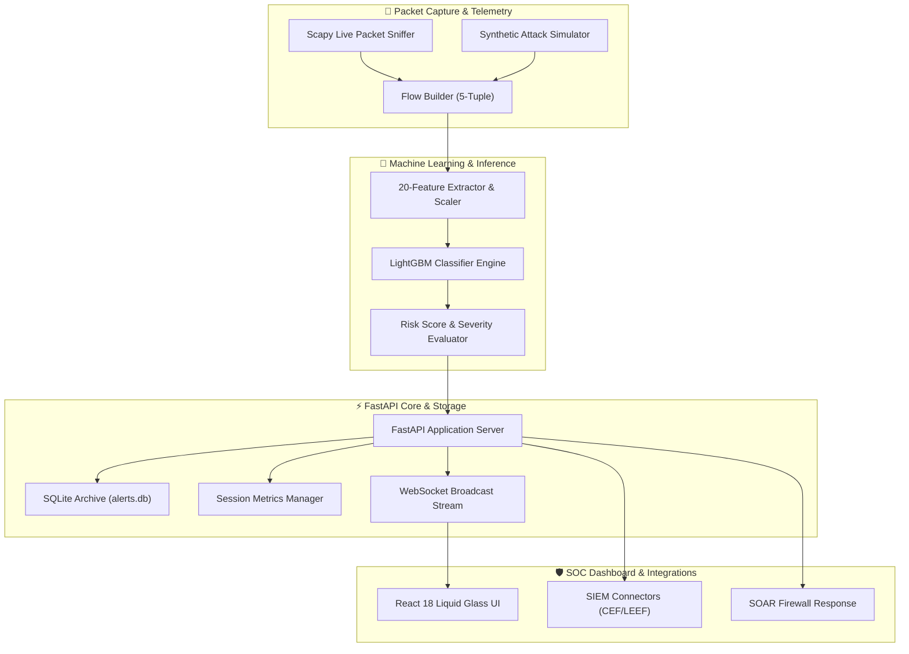

<div align="center">

# 🛡️ CORTEX NIDS
### Commercial-Grade Real-Time Network Intrusion Detection System & Security Operations Platform

<p align="center">
  
  
  
  
  
  
  
</p>

[**🌐 Live Repo**](https://github.com/saifvector/cortex-nids) • [**📖 Interactive API Docs**](http://localhost:8000/docs) • [**⚡ Quick Start**](#-quick-start--installation) • [**🧪 Live Telemetry Guide**](#-live-telemetry--traffic-testing-guide)

---

</div>

## 📌 Executive Overview

**Cortex NIDS** is an enterprise-class, machine learning-powered Security Operations Center (SOC) platform designed to sniff, classify, score, and neutralize high-throughput network threats in real time. 

Powered by a **LightGBM Classifier Engine (`99.87%` accuracy, `20.4ms` latency)** trained on 2.83M CICIDS2017 flow samples, Cortex NIDS transforms raw network packet streams into actionable security intelligence with automated SOAR firewall responses, SIEM log streaming (Elastic/Splunk/Sentinel), and a futuristic **React 18 Liquid Glass Dashboard**.

---

## ✨ Key Features at a Glance

| Feature Module | Description | Technical Implementation |
| :--- | :--- | :--- |
| ⚡ **Live Threat Monitor** | Sub-second real-time WebSocket alert stream with animated threat cards. | Scapy Sniffer + `/ws/alerts` WebSockets |
| 🧠 **ML Prediction Engine** | 15-class intrusion classifier scoring risk levels (`Low` to `Critical`). | LightGBM + Joblib Pipeline |
| 📦 **Historical Threats Archive** | Permanent SQLite threat database (`alerts.db`) with full search & modal inspection. | SQLite + SQLAlchemy + Dynamic Filters |
| 📊 **Historical Analytics** | Threat trend timelines, attack pie charts, and top attacker IP heatmaps. | Recharts + Analytical Queries |
| 📄 **Dynamic Report Engine** | Compiles on-demand **PDF**, **HTML**, **CSV**, and **Markdown** security audit reports. | ReportLab + Dynamic Pandas Exporter |
| 🔍 **Global System Search** | Instant modal search matching IPs, Attack Types, Alert IDs, Ports, and Modules. | `GET /search` + `⌘K` / `Ctrl+K` Hotkey |
| 🔔 **SOC Notification Center** | Real-time WebSocket alert notifications with unread counter badges. | NotificationStore + Slide-Over Drawer |
| 🧠 **Explainable AI (XAI)** | Live feature importance rankings extracted directly from trained model checkpoints. | `model.feature_importances_` + Recharts |

---

## 🏛️ Architectural Navigation & Data Flow

Cortex NIDS completely decouples **LIVE Session Telemetry** from **HISTORICAL Database Archives**:

```text
 ┌─────────────────────────────────────────────────────────────────────────────┐
 │                         CORTEX NIDS NAVIGATION                              │
 ├──────────────────┬──────────────────┬──────────────────┬────────────────────┤
 │ 🔴 Dashboard     │ ⚡ Live Threats  │ 📦 Historical    │ 📊 Historical      │
 │    (Session)     │    (WebSocket)   │    Threats (DB)  │    Analytics       │
 ├──────────────────┼──────────────────┼──────────────────┼────────────────────┤
 │ 📄 Reports       │ 🧪 Single        │ 📂 Batch         │ 🧠 Feature         │
 │    Center        │    Predictor     │    Analysis      │    Importance (XAI)│
 └──────────────────┴──────────────────┴──────────────────┴────────────────────┘
```



---

## 🧪 Live Telemetry & Traffic Testing Guide

You can test live intrusion detection using either **Real Packet Capture Sniffing** or **Synthetic Attack Simulation**.

### Step 1: Launch Backend & Frontend Servers

**Terminal 1 (Backend API)**:
```powershell
.\.venv\Scripts\python.exe scripts/run_api.py
```

**Terminal 2 (React Frontend UI)**:
```powershell
npm --prefix frontend run dev
```

*(Or launch both in 1-click using `powershell -ExecutionPolicy Bypass -File scripts\start_local.ps1`)*

---

### Step 2: Choose Live Traffic Test Method

#### 🌐 Method A: Real Packet Capture Sniffer (`scripts/run_live_monitor.py`)
Sniffs real network packets directly from your Wi-Fi/Ethernet adapters using Scapy, builds 5-tuple flow statistics, executes ML inference, and logs alerts to `alerts.db` and the UI:

1. **List Network Interfaces**:
   ```powershell
   .\.venv\Scripts\python.exe scripts/run_live_monitor.py --list-ifaces
   ```

2. **Start Continuous Live Packet Monitoring**:
   ```powershell
   .\.venv\Scripts\python.exe scripts/run_live_monitor.py --duration 0
   ```

3. **Generate Real Traffic (e.g., Ping Google or Web Browsing)**:
   In a separate terminal, trigger real ICMP/HTTP network traffic:
   ```powershell
   # Ping Google continuously to generate live network flow packets
   ping google.com -t
   ```
   Or send HTTP GET requests:
   ```powershell
   curl https://google.com
   ```
   *Watch `run_live_monitor.py` capture the live ICMP/TCP packets, extract features, predict risk, and stream alerts live to the dashboard!*

---

#### ⚡ Method B: Synthetic Threat Generator (`scripts/simulate_live_attacks.py`)
Generates realistic statistical attack profiles (DoS, DDoS, PortScan, Benign) and posts prediction telemetry directly to the API & WebSockets every second:

```powershell
# Stream live threat traffic every 1.0 second continuously
.\.venv\Scripts\python.exe scripts/simulate_live_attacks.py --interval 1.0 --duration 0
```

| Profile Name | Weight | Target Protocol | Description |
| :--- | :---: | :--- | :--- |
| 🟢 **BENIGN** | `70%` | HTTP (80/443), DNS (53) | Clean web browsing & name resolution traffic. |
| 🔴 **DoS GoldenEye** | `10%` | HTTP (80/443) | High packet-volume HTTP Denial-of-Service attack. |
| ⚡ **DDoS** | `10%` | TCP (80/8080/22) | Massive bandwidth Distributed Denial-of-Service. |
| 🔍 **PortScan** | `10%` | Multi-Port Probes | Rapid single-packet scanning across ports 21–8443. |

---

### Step 3: Observe Live Telemetry in UI

1. Open **[`http://localhost:3000/live-threats`](http://localhost:3000/live-threats)**: Watch incoming threat cards stream live via WebSockets.
2. Open **[`http://localhost:3000/`](http://localhost:3000/)**: Watch session prediction counters, attack rates, and risk meters increase in real time.
3. Open **[`http://localhost:3000/historical-threats`](http://localhost:3000/historical-threats)**: Inspect permanent records stored in `alerts.db`.
4. Press **`⌘K`** or **`Ctrl+K`**: Search for `DDoS`, `PortScan`, or specific IPs across the entire platform.

---

## 🚀 Quick Start & Installation

```bash
# Clone the repository
git clone https://github.com/saifvector/cortex-nids.git
cd cortex-nids
```

### Option 1: Automated Local Setup

#### Windows (PowerShell):
```powershell
powershell -ExecutionPolicy Bypass -File setup.ps1
```

#### Linux / macOS (Bash):
```bash
chmod +x setup.sh && ./setup.sh
```

---

### Option 2: Docker Containerized Deployment

```powershell
# Core Stack (Backend + Frontend)
docker compose -f docker-compose.local.yml up -d --build

# Full Production Stack (Backend + Frontend + Prometheus + Grafana)
docker compose up -d --build
```

---

## 🌐 Application Access Points

| Service | Access URL | Description |
| :--- | :--- | :--- |
| **React SOC Dashboard** | [http://localhost:3000](http://localhost:3000) | $100M Liquid Glass Security Operations Platform |
| **Live Threat Stream** | [http://localhost:3000/live-threats](http://localhost:3000/live-threats) | Real-time WebSocket Threat Monitor |
| **Historical Threats Archive** | [http://localhost:3000/historical-threats](http://localhost:3000/historical-threats) | SQLite `alerts.db` Permanent Searchable Archive |
| **FastAPI REST API** | [http://localhost:8000](http://localhost:8000) | Sub-millisecond ML Prediction API |
| **Interactive API Docs** | [http://localhost:8000/docs](http://localhost:8000/docs) | Swagger OpenAPI Reference |
| **Prometheus Metrics** | [http://localhost:9090](http://localhost:9090) | Operational metric scraping |
| **Grafana Visualizer** | [http://localhost:3001](http://localhost:3001) | Real-time infrastructure monitoring |

---

## 📊 Dataset & Machine Learning Performance

The system is trained on **2,830,743 network traffic records** from the benchmark CICIDS2017 dataset, covering 15 attack vectors.

### Model Evaluation Metrics:

| Classifier Model | Accuracy | Precision | Recall | F1-Score | Inference Latency |
| :--- | :---: | :---: | :---: | :---: | :---: |
| **LightGBM (Primary)** | **99.87%** | **0.9984** | **0.9987** | **0.9005** | **20.4 ms** |
| XGBoost | 99.84% | 0.9981 | 0.9984 | 0.8980 | 32.1 ms |
| CatBoost | 99.82% | 0.9979 | 0.9982 | 0.8950 | 45.0 ms |
| Random Forest | 99.79% | 0.9975 | 0.9979 | 0.8910 | 58.2 ms |

---

## 🧪 Automated Testing & System QA

Run the full automated test suite (70 test cases, 100% pass rate):

```powershell
.\.venv\Scripts\python.exe -m pytest tests/
```

Or run the QA suite runner:
```powershell
.\.venv\Scripts\python.exe scripts/run_tests.py
```

```text
==========================================
ENTERPRISE NIDS QA & TESTING SUMMARY
==========================================
Total Test Cases Executed : 70
Passed Test Cases         : 70
Failed Test Cases         : 0
Pass Rate                 : 100.0%
==========================================
```

---

## 📄 License & Acknowledgements

- **Repository**: [`https://github.com/saifvector/cortex-nids`](https://github.com/saifvector/cortex-nids)
- **Author**: [@saifvector](https://github.com/saifvector)
- **License**: Released under the [MIT License](LICENSE).
- **Dataset**: Credit to the Canadian Institute for Cybersecurity (CIC) for the CICIDS2017 network intrusion telemetry.
