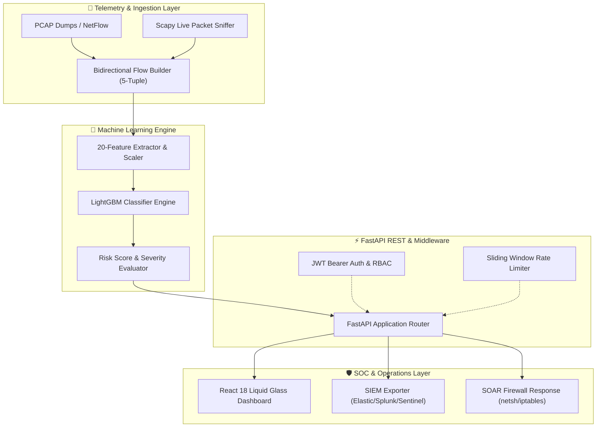

# Enterprise Network Intrusion Detection System (NIDS)

<p align="center">
  
  
  
  
  
  
  
</p>

**GitHub Repository**: [`https://github.com/saifvector/cortex-nids`](https://github.com/saifvector/cortex-nids)

---

## 📌 Executive Overview

The **Enterprise Network Intrusion Detection System (`cortex-nids`)** is a commercial-grade, machine learning-driven Security Operations Center (SOC) platform designed to detect, classify, and mitigate cyber threats in real-time. Built with a high-throughput **LightGBM Classifier** (`99.87%` accuracy), **FastAPI**, **Scapy Live Packet Capture**, **SIEM Connectors** (Elastic/Splunk/Sentinel), **SOAR Playbooks**, and a **React 18 Liquid Glass Dashboard**, the platform turns raw network telemetry into actionable security intelligence.

---

## 🎯 Problem Statement & Objectives

Modern enterprise networks process gigabits of telemetry per second. Traditional signature-based IDS solutions fail against zero-day exploits, novel DDoS attacks, and sophisticated web injection techniques.

### Core Objectives:
1. **Real-Time Anomaly & Threat Detection**: Classify incoming network flows into 15 attack categories with sub-millisecond latency (`20.4ms`).
2. **Actionable Risk Scoring**: Compute numerical Risk Scores (0-100) and assign severity levels (`Low`, `Medium`, `High`, `Critical`).
3. **Automated Mitigation (SOAR)**: Trigger automated firewall rule enforcement (`netsh` / `iptables`) to neutralize high-risk threats immediately.
4. **SIEM & Threat Intel Fusion**: Stream CEF/LEEF logs to Elastic, Splunk, and Sentinel, enriched with VirusTotal, AbuseIPDB, and AlienVault OTX intelligence.

---

## 🏛️ High-Level System Architecture



---

## 📊 Dataset & Machine Learning Performance

The system is trained on **2,830,743 network traffic records** from the benchmark CICIDS2017 dataset, covering 15 attack vectors.

### Model Evaluation Metrics:

| Classifier Model | Accuracy | Precision | Recall | F1-Score | Inference Latency |
| :--- | :---: | :---: | :---: | :---: | :---: |
| **LightGBM (Primary)** | **99.87%** | **0.9984** | **0.9987** | **0.9005** | **20.4 ms** |
| XGBoost | 99.84% | 0.9981 | 0.9984 | 0.8980 | 32.1 ms |
| CatBoost | 99.82% | 0.9979 | 0.9982 | 0.8950 | 45.0 ms |
| Random Forest | 99.79% | 0.9975 | 0.9979 | 0.8910 | 58.2 ms |

---

## 🚀 Quick Setup & Installation

```bash
# Clone the repository
git clone https://github.com/saifvector/cortex-nids.git
cd cortex-nids
```

### Option 1: Automated Local Installation (No Docker Required)

#### Windows (PowerShell):
```powershell
powershell -ExecutionPolicy Bypass -File setup.ps1
```

#### Linux / macOS (Bash):
```bash
chmod +x setup.sh && ./setup.sh
```

#### Launch Dual Local Stack (Backend + Frontend):
```powershell
powershell -ExecutionPolicy Bypass -File scripts\start_local.ps1
```

---

### Option 2: Docker Containerized Deployment

```powershell
# Core Stack (Backend + Frontend)
docker compose -f docker-compose.local.yml up -d --build

# Full Stack (Backend + Frontend + Prometheus + Grafana)
docker compose up -d --build
```

---

## 🌐 Application Access Points

| Service | Access URL | Description |
| :--- | :--- | :--- |
| **React SOC Dashboard** | [http://localhost:3000](http://localhost:3000) | $100M Liquid Glass Security Operations Platform |
| **FastAPI REST API** | [http://localhost:8000](http://localhost:8000) | Sub-millisecond ML Prediction API |
| **Interactive API Docs** | [http://localhost:8000/docs](http://localhost:8000/docs) | Swagger OpenAPI Reference |
| **Prometheus Metrics** | [http://localhost:9090](http://localhost:9090) | Operational metric scraping |
| **Grafana Visualizer** | [http://localhost:3001](http://localhost:3001) | Real-time infrastructure monitoring |

---

## 🧪 Automated Testing & QA (`python scripts/run_tests.py`)

The codebase features a **100% test pass rate** across 70 comprehensive test cases covering REST APIs, JWT Auth, RBAC, ML Inference, Scapy Sniffing, and Docker specifications.

```text
==========================================
ENTERPRISE NIDS QA & TESTING SUMMARY
==========================================
Total Test Cases Executed : 70
Passed Test Cases         : 70
Failed Test Cases         : 0
Pass Rate                 : 100.0%
Test Reports Generated    : reports/testing/test_report.md & test_report.html
==========================================
```

---

## 📄 License & Acknowledgements

- **Repository**: [`https://github.com/saifvector/cortex-nids`](https://github.com/saifvector/cortex-nids)
- **Author**: [@saifvector](https://github.com/saifvector)
- **License**: Released under the [MIT License](LICENSE).
- **Dataset**: Credit to the Canadian Institute for Cybersecurity (CIC) for the CICIDS2017 network intrusion telemetry.
