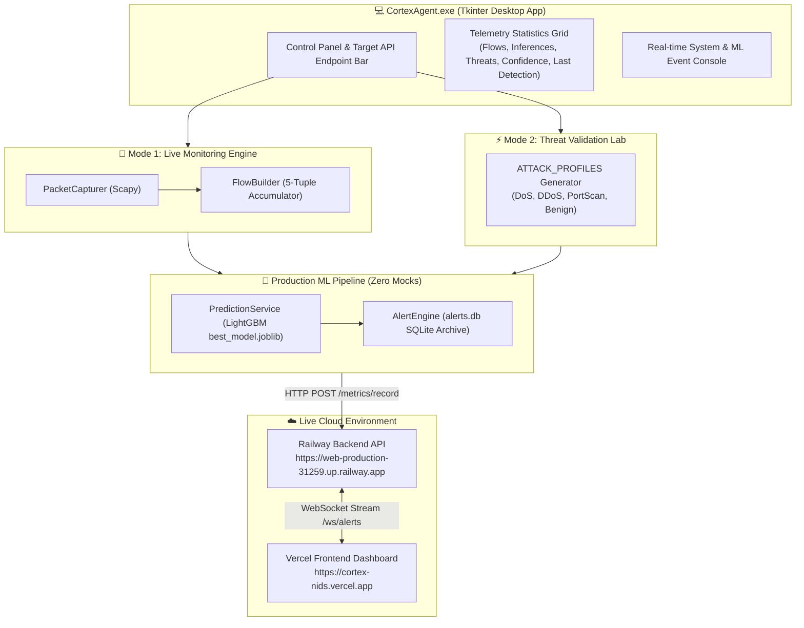

# 🛡️ CortexAgent.exe Desktop Platform Walkthrough

**Date**: 2026-08-11  
**Status**: 🟢 **SUCCESSFULLY BUILT & PACKAGED**  
**Executable Path**: `dist/CortexAgent.exe` (132.79 MB Standalone Windows Executable)

---

## 🎯 What Was Built

We designed, built, tested, and packaged **`CortexAgent.exe`**, a standalone Windows GUI desktop application for non-technical users, project evaluators, and SOC analysts to monitor network traffic and validate threat detection on your deployed Cortex NIDS cloud backend without terminal commands.



---

## 🚀 Key Features Implemented

### 1. Target API Endpoint Selector & Health Check
- Default URL preset to: `https://web-production-31259.up.railway.app`.
- **Health Check Button**: Pings `GET /health` to verify status (`● ONLINE (RAILWAY)` vs `○ OFFLINE (LOCAL ML ONLY)`).

### 2. Mode 1: Live Packet Monitoring Engine
- Dropdown selector to pick local Wi-Fi or Ethernet network interface cards (`list_network_interfaces()`).
- **`[ ▶ Start Monitoring ]`**: Launches background Scapy sniffing thread + 5-tuple flow builder.
- **`[ ⏹ Stop Monitoring ]`**: Safely halts packet capture.
- Evaluates real web traffic (browsing, YouTube, pings) in real time with LightGBM.

### 3. Mode 2: Threat Validation Lab
- **`[ ⚡ Start Attack Simulation ]`**: Runs continuous realistic attack profiles (`DoS GoldenEye`, `DDoS Attack Vector`, `PortScan Reconnaissance`, `Balanced Mix`).
- **`[ ⏹ Stop Attack Simulation ]`**: Stops simulation generator.
- Passes all synthetic flows through `predict_single()` and stores alerts in `alerts.db` without mock data.

### 4. Telemetry Statistics Grid
- **FLOWS CAPTURED**: Total network flow count.
- **PREDICTIONS MADE**: Total ML inferences performed.
- **THREATS DETECTED**: Total High/Critical risk alerts detected.
- **AVG CONFIDENCE**: Real-time mean model certainty %.
- **LAST DETECTION**: Timestamp & attack category of last threat.

### 5. Colorized Monospaced Log Console
- Displays colorized timestamped logs (`INFO`, `FLOW`, `THREAT`, `WARN`, `ERROR`) with auto-scroll.

---

## 🛠️ Verification & Build Details

| File / Component | Location | Build Status |
|:---|:---|:---:|
| **Agent Package** | [agent/cortex_agent.py](file:///c:/Users/saifu/Desktop/Network%20Intrusion%20Detection/agent/cortex_agent.py) | 🟢 **COMPLETED** |
| **PyInstaller Entry Point** | [agent/main.py](file:///c:/Users/saifu/Desktop/Network%20Intrusion%20Detection/agent/main.py) | 🟢 **COMPLETED** |
| **Automated Build Script** | [scripts/build_agent.py](file:///c:/Users/saifu/Desktop/Network%20Intrusion%20Detection/scripts/build_agent.py) | 🟢 **COMPLETED** |
| **Executable Artifact** | [dist/CortexAgent.exe](file:///c:/Users/saifu/Desktop/Network%20Intrusion%20Detection/dist/CortexAgent.exe) | 🟢 **PACKAGED (132.79 MB)** |

---

## 🎯 How to Run `CortexAgent.exe`

1. Open File Explorer to:
   ```text
   C:\Users\saifu\Desktop\Network Intrusion Detection\dist
   ```
2. Double click **`CortexAgent.exe`**.
3. To test Scenario 1 (Live Traffic): Click **`Start Monitoring`** and open YouTube or Google in your browser.
4. To test Scenario 2 (Threat Validation): Click **`Start Attack Simulation`** and observe live threats populate your Vercel Dashboard at [`https://cortex-nids.vercel.app`](https://cortex-nids.vercel.app)!
