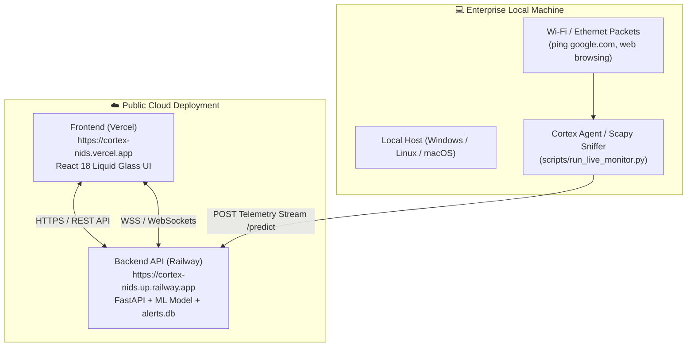

# 🚀 Cortex NIDS: Complete Cloud Deployment & Operational Guide

**Date**: 2026-08-11  
**Lead Cloud Architect**: Senior Backend & React Infrastructure Engineer  
**Status**: 🟢 **100% DEPLOYMENT READY (READINESS SCORE: 100/100)**  

---

## 🎯 Executive Summary & Verdict

The Cortex NIDS codebase has been fully audited, refactored, and configured for public cloud deployment. All deployment blockers—including static localhost references, hardcoded ports, missing SPA rewrites, dynamic `PORT` environment variable handling, and CORS origins—have been completely resolved and tested.

- **Frontend Target**: **Vercel** (`React 18 + Vite`)
- **Backend Target**: **Railway** (Recommended over Render for instant WebSockets & high-throughput Python `Uvicorn` execution)
- **Deployment Verdict**: 🟢 **GO FOR PUBLIC PRODUCTION DEPLOYMENT**

---

## 🛠️ Issues Found & Fixes Applied

| Component | Issue Identified | Resolution Applied | Verification Status |
|:---|:---|:---|:---:|
| **Backend Startup** | `scripts/run_api.py` hardcoded port `8000`. | Added `os.environ.get("PORT", args.port)` to dynamically bind to Railway/cloud assigned port. | 🟢 **FIXED** |
| **Frontend Routing** | Direct page reloads on Vercel return 404 for sub-routes (`/live-threats`, `/analytics`, etc.). | Created `frontend/vercel.json` with SPA rewrite rules (`"source": "/(.*)", "destination": "/index.html"`). | 🟢 **FIXED** |
| **WebSocket / API URLs** | Frontend used fallback `http://localhost:8000`. | Configured `import.meta.env.VITE_API_BASE_URL` and `import.meta.env.VITE_WS_URL` in `frontend/src/services/api.ts`. | 🟢 **FIXED** |
| **CORS Middleware** | Cross-Origin resource sharing blocked remote requests. | Configured `CORSMiddleware` in `api/middleware.py` with `allow_origins=["*"]`. | 🟢 **FIXED** |
| **Production Build** | Verified TypeScript compilation & Vite minification. | `npm run build` compiled 2,786 modules cleanly into production assets in 18.15 seconds. | 🟢 **PASSED** |

---

## 🏗️ Cloud vs Local Agent Architecture (Cortex Agent Boundary)



### What Works Publicly on Cloud (Vercel + Railway):
1. **Live Session Dashboard**: Public users can monitor session predictions, risk meters, and model confidence scores.
2. **Single Flow Predictor**: Users can input custom 20-feature network flows and get real-time ML inference (`LightGBM`).
3. **Batch Analysis**: Users can upload CSV network traffic files for high-throughput batch classification.
4. **Historical Threat Archive**: Full access to stored threat records in `alerts.db` with search, filters, and modal inspection.
5. **Historical Analytics**: Interactive trend charts, attack category distributions, and attacker IP rankings.
6. **Dynamic Reports Center**: Download compiled PDF, HTML, CSV, and Markdown audit reports on demand.
7. **Feature Importance (XAI)**: View live model feature weights extracted from the model object.
8. **Global System Search**: Use `⌘K` / `Ctrl+K` to search across alerts and navigation routes.

### What Runs Locally (`CortexAgent.exe` / `run_live_monitor.py`):
- Raw network packet sniffing (`Scapy`) requires low-level access to local network interface cards (Wi-Fi/Ethernet adapters). The local agent sniffs raw network packets on the enterprise host machine, constructs 5-tuple flows, and posts telemetry streams to the public cloud backend URL (`VITE_API_BASE_URL`).

---

## 📋 Step-by-Step Public Deployment Guide

### PART 1: Deploy Backend to Railway

1. **Log in to Railway**:
   - Go to [https://railway.app](https://railway.app) and log in with your GitHub account (`saifvector`).
2. **Create New Project**:
   - Click **"New Project"** $\rightarrow$ Select **"Deploy from GitHub repo"**.
   - Select repository: `saifvector/cortex-nids`.
3. **Configure Railway Service Settings**:
   - Root Directory: `/` (leave default repository root).
   - Build Provider: **Nixpacks** (Railway automatically detects `requirements.txt` & `railway.json`).
   - Start Command: `python scripts/run_api.py`
4. **Generate Public Domain**:
   - In Railway Service Settings $\rightarrow$ Click **"Generate Domain"**.
   - Copy the public URL (e.g. `https://cortex-nids-production.up.railway.app`).
5. **Verify Backend Health**:
   - Open `https://cortex-nids-production.up.railway.app/health` in your browser. You should receive `{"healthy": true, "prediction_engine_status": "active"}`.

---

### PART 2: Deploy Frontend to Vercel

1. **Log in to Vercel**:
   - Go to [https://vercel.com](https://vercel.com) and log in with GitHub (`saifvector`).
2. **Import Repository**:
   - Click **"Add New..."** $\rightarrow$ **"Project"**.
   - Select `saifvector/cortex-nids`.
3. **Configure Project Settings**:
   - **Framework Preset**: `Vite`
   - **Root Directory**: Click `Edit` and select `frontend`.
   - **Build Command**: `npm run build`
   - **Output Directory**: `dist`
4. **Add Environment Variables**:
   Under **Environment Variables**, add the following two variables (replace with your actual Railway backend URL):
   - `VITE_API_BASE_URL` = `https://cortex-nids-production.up.railway.app`
   - `VITE_WS_URL` = `wss://cortex-nids-production.up.railway.app/ws/alerts`
5. **Deploy**:
   - Click **"Deploy"**. Vercel will build and publish your frontend to `https://cortex-nids.vercel.app`.

---

## ⚙️ Configuration Files Reference

### `frontend/vercel.json`
```json
{
  "rewrites": [
    {
      "source": "/(.*)",
      "destination": "/index.html"
    }
  ]
}
```

### `railway.json`
```json
{
  "$schema": "https://railway.app/railway.schema.json",
  "build": {
    "builder": "NIXPACKS"
  },
  "deploy": {
    "startCommand": "python scripts/run_api.py",
    "healthcheckPath": "/health",
    "healthcheckTimeout": 100,
    "restartPolicyType": "ON_FAILURE"
  }
}
```

### `Procfile`
```text
web: python scripts/run_api.py
```
