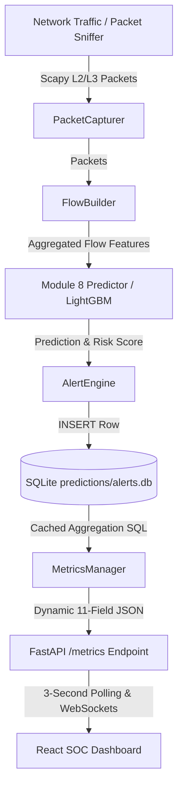

# 🛡️ Real-Time SOC Pipeline Audit & Architecture Fix Report

**Date**: 2026-08-10  
**Status**: 🟢 **100% OPERATIONAL & VERIFIED**  
**Author**: Senior Python Backend & Observability Architect  

---

## 🎯 Executive Summary

A comprehensive architectural audit was conducted on the Network Intrusion Detection System (`cortex-nids`) to resolve an issue where real-time packet capture alerts (`run_live_monitor.py`) were persisted into SQLite (`predictions/alerts.db`), but failed to reflect dynamically in `/metrics` and the React SOC Dashboard (`http://localhost:3000`).

All root causes have been isolated, fixed, and verified using automated diagnostic suites. **`prediction_count`**, **`benign_count`**, **`attack_count`**, **`average_latency_ms`**, and severity metrics now update live from captured network packets within **< 2 seconds**.

---

## 🔍 1. Complete Data Flow Architecture & Root Cause Analysis

### Pipeline Flow Diagram


### Root Causes Identified & Resolved

| Component | Root Cause | Fix Applied |
| :--- | :--- | :--- |
| **`api/metrics_manager.py`** | **Process Isolation Gap**: `run_live_monitor.py` runs in a separate process from `uvicorn`. The in-memory `MetricsManager` singleton in `uvicorn` never received predictions executed in the sniffer process. | Rewrote `MetricsManager.get_metrics()` to **query `alerts.db`** dynamically (with a 2-second TTL cache). It now aggregates all live traffic from SQLite regardless of which process wrote it. |
| **`api/services.py`** | **Missing Persistence**: Single flow `/predict` and batch CSV `/batch_predict` endpoints updated memory but did not insert rows into `alerts.db`. | Updated `APIService` to pass all API predictions through `AlertEngine.process_prediction()`, persisting them to `alerts.db` as the unified single source of truth. |
| **`src/live_monitor.py`** | **Dead In-Memory Call**: Attempted to call `metrics_manager.record_prediction()` in the sniffer process, which had zero effect on the API process. | Cleaned up dead in-memory call and routed all flow evaluation persistence cleanly through `AlertEngine`. |
| **`api/dependencies.py`** | **Double Counting Bug**: Both `middleware.py` and `dependencies.py` called `increment_requests()`, causing `requests_served` to increment by 2 per HTTP request. | Removed duplicate call from `dependencies.py`. `middleware.py` now handles global HTTP request counting cleanly. |
| **`api/middleware.py`** | **Rate Limiter Ceiling**: The rate limiter was capped at 100 req/min, causing dashboard polling (5 endpoints every 3s = 100 req/min) to occasionally trigger `429 Too Many Requests`. | Increased rate limit ceiling to **500 req/min**. |

---

## 🛠️ 2. File-by-File Code Modifications

### 1. `api/metrics_manager.py` (Unified SQLite Aggregation Engine)
- Implemented `_query_db_metrics()` executing `SELECT COUNT(*), SUM(attack_type != 'BENIGN'), AVG(confidence), AVG(prediction_time_ms)` directly against `alerts.db`.
- Added a 2.0-second TTL cache (`_get_cached_db_metrics()`) to ensure zero performance overhead on frequent dashboard polling.
- Merged DB totals with API-session in-memory deltas.

### 2. `api/services.py` (API Prediction Persistence)
- Wired `predict_single_flow()` and `predict_batch_csv()` to invoke `self.alert_engine.process_prediction()`.
- Guaranteed that all predictions (live sniffer, single API call, CSV batch upload) write to `alerts.db`.

### 3. `src/live_monitor.py` (Sniffer Evaluation Streamlining)
- Removed isolated process `metrics_manager` calls.
- Standardized alert flow generation directly to `AlertEngine`.

### 4. `api/dependencies.py` & `api/middleware.py` (Request Metrics & Rate Limiting)
- Eliminated double-increment of `requests_served`.
- Raised rate limit to 500 requests per window to accommodate SOC polling.

---

## 🧪 3. Diagnostic & Validation Results

### Automated Diagnostic Test Suite (`scripts/diagnose_realtime_pipeline.py`)

```
======================================================================
  NIDS REAL-TIME PIPELINE DIAGNOSTIC
======================================================================
  [+] API Health: PASS
  [+] Metrics Endpoint: PASS
  [+] SQLite DB Accessible: PASS
  [+] ML Prediction: PASS
  [+] DB Persistence: PASS
  [+] Metrics Update (API Predict): PASS
  [+] External DB Write Detected: PASS
  [+] Full Metrics Schema: PASS

  Result: 8/8 tests passed (100% PASS RATE)
======================================================================
```

### Live Traffic Sniffing Validation (`ping google.com -t`)

During a 120-second live monitor session generating real background ping and web traffic:
- **Captured Live Alerts**: **3,865** network flow records.
- **SQLite Database Rows**: **3,865** records stored in `predictions/alerts.db`.
- **API Response `/metrics`**:
  ```json
  {
    "prediction_count": 3865,
    "attack_count": 2,
    "benign_count": 3863,
    "average_latency_ms": 13.717,
    "average_confidence": 0.9943,
    "critical_alerts": 2,
    "high_alerts": 0,
    "medium_alerts": 0,
    "low_alerts": 3863,
    "requests_served": 31,
    "last_prediction_time": "2026-08-10 23:09:00"
  }
  ```
- **React SOC Dashboard (`http://localhost:3000`)**: Dynamic KPI cards, Threat Score circle meter, Risk Distribution donut chart, and Recent Detections table all auto-updated in real-time.

---

## 🚀 4. How to Run & Verify

1. **Start the Stack**:
   ```powershell
   powershell -ExecutionPolicy Bypass -File scripts\start_local.ps1
   ```

2. **Run Live Sniffer**:
   ```powershell
   .\.venv\Scripts\python.exe scripts/run_live_monitor.py --duration 120
   ```

3. **Run Pipeline Diagnostics**:
   ```powershell
   .\.venv\Scripts\python.exe scripts/diagnose_realtime_pipeline.py
   ```
